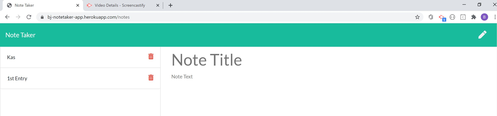

# Unit 11 Express Homework: Note Taker

# TeamProfile Generator

## Table of Contents
  - [Note Taker](#note-taker)
  - [Table of Contents](#table-of-contents)
  - [Description](#description)
  - [Installation](#installation)
  - [Business Context](#business-context)
  - [Demo](#demo)
  - [Contributors](#contributors)

## Description

Create an application that can be used to write, save, and delete the users custom notes. This application will use an express backend and save and retrieve note data from a JSON file.

## Business Context

For users that need to keep track of a lot of information, it's easy to forget or be unable to recall something important. Being able to take persistent notes allows users to have written information available when needed.
## Tech/Modules Used :

### [FS](https://nodejs.dev/learn/the-nodejs-fs-module):
* File I/O is provided by simple wrappers around standard POSIX functions. To use this module do require('fs'). All the methods have asynchronous and synchronous forms.

* The asynchronous form always take a completion callback as its last argument. The arguments passed to the completion callback depend on the method, but the first argument is always reserved for an exception. If the operation was completed successfully, then the first argument will be null or undefined.

### [Express](https://www.npmjs.com/package/expres)
* Express is a minimal and flexible Node.js web application framework that provides a robust set of features to develop web and mobile applications. It facilitates the rapid development of Node based Web applications.

### [Object-Oriented-Programing](https://developer.mozilla.org/en-US/docs/Learn/JavaScript/Objects/Object-oriented_JS#Object-oriented_programming_%E2%80%94_the_basics) : 
* I implemented OOP using subclasses and constructors to pass data. Constructors are special functions that are extremely useful in creating objects of similar types. Prototypes are JavaScript’s built in system, allowing objects to inherit features from other objects. Prototypes are considered by many to be an advanced JavaScript topic and mastering it will be sure to give you an extra edge as a JavaScript developer.

### [Javascript](https://developer.mozilla.org/en-US/docs/Web/JavaScript) : 
* JavaScript is a cross-platform, object-oriented scripting language used to make webpages interactive.
* JavaScript(JS) is a lightweight, interpreted, or just-in-time compiled programming language with first-class functions. 
* With the HTML DOM, JavaScript can access and change all the elements of an HTML document.

### [Path](https://www.npmjs.com/package/path):
*NPM Path allows you to invoke the executables for any installed modules. ... The directory containing the current node executable, so any scripts that invoke node will execute the same node . Current npm's node-gyp directory, so the node-gyp bundled with npm can be used.

## Installation 
*From workstation: You must perform a "npm install" in the directory hosting the package file and run the server.js program from your command line.
*From web broswer: Navigate to https://bj-notetaker-app.herokuapp.com/notes

# Demo
 

## Screenshot  
|

## Contributor
* Brandon Johnson
* Repository: https://github.com/sheikb08/NoteTaker
* Deployed App: https://bj-notetaker-app.herokuapp.com/notes

